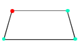

# BreezeVertex 



## Introduction

BreezeVertex is a simple pad vertex detection training project based on pytorch

## Install

### Requirements

- Linux or MacOS
- CUDA >= 10.0
- Python >= 3.7
- Pytorch >= 1.9

### Step

1. Create a conda virtual environment and then activate it.

```bash
conda create -n vertex python=3.7 -y
conda activate vertex
```

2. Install pytorch

```bash
conda install pytorch torchvision cudatoolkit=11.1 -c pytorch -c conda-forge
```

3. Clone this repository

```bash 
git clone https://github.com/tunmx/LP-Vertex.git
cd LP-Vertex
```

4. Install requirements

```bash 
pip install -r requirements.txt
```

5. Setup breezevertex

```bash 
python setup.py develop
```

## How to Train

### 1. Prepare dataset

You can use the polygon format of the Polyelimg annotated point set for training datasets. For details, see the **data_sample/** folder example.

### 2. Prepare config file

Execute the command to generate a default config file. You can modify the config file according to your needs.

```bash
bvt generate ./config/
```

### 3. Start training

```bash
bvt train CONFIG_PATH
```

### 4. Visualize Logs

You can use the wandb configuration in config to view the training log online.

## How to Test

### 1. Test trained model

After training the model, you can execute the test using the test instruction.

```bash
bvt test CONFIG_PATH -show  # add show flag can show images
```

### 2. Evaluate

Execute the evaluate command to evaluate the model.

```bash
bvt evaluate CONFIG_PATH
```

## How to Deploy

Currently, only onnx can be exported.

### 1. Export model to ONNX

Execute the export instruction to export the onnx model.

```bash
bvt export onnx --config CONFIG_PATH  --input_shape 112 112
```

## Example

License plate vertex example.

